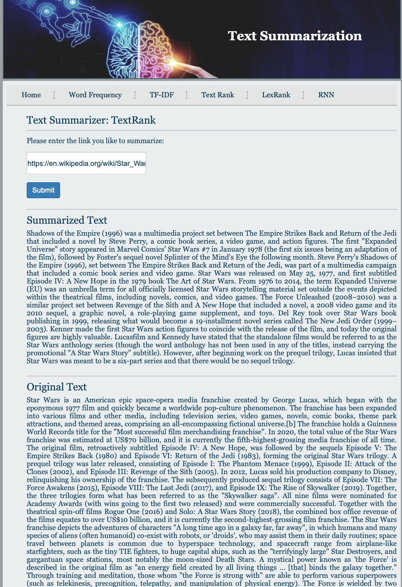

# Text-Summarization

What the problem is? 
Text summarization is the technique for generating a concise and precise summary of voluminous texts while focusing on the sections that convey useful information, and without losing the overall meaning. The intention is to create a coherent and fluent summary having only the main points outlined in the document.

Supervised machine learning problem

Available algorithms? Pros and cons?

 There are two approaches to summarizing texts in NLP: extraction and abstraction.
Extraction- based summarization: a subset of words that represent the most important points is pulled from a piece of text and combined to make a summary. In other word, Select relevant phrases of the input document and concatenate them to form a summary (like “copy-and-paste”). In machine learning, extractive summarization usually involves weighing the essential sections of sentences then ranked them according to their relevance and similarity with one another and using the results to generate summaries.

Steps:
Convert paragraph into sentences
Text Processing: Removing the stop words, numbers, punctuation …
Create word frequency table
Tokenization
Create algorithm for scoring sentences
Calculating the threshold of the sentences

Advantages: They are quite robust since they use existing natural-language phrases that are taken straight from the input.

Disadvantage: But they lack in flexibility since they cannot use novel words or connectors. They also cannot paraphrase like people sometimes do.

Measures: ROUGE

